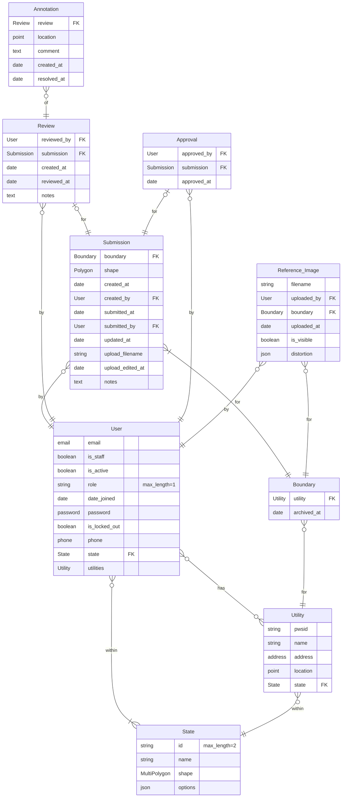

# IOW Entity Relationship Diagram

## Context

Below is the Entity Relationship Diagram illustrating the initial data model as discussed in Issue #69. Not included in the diagram at the time of creation are the file fields for `ReferenceImage` and `Submission` that would reference those respective file S3 uploads (to be implemented in Issue #81).

