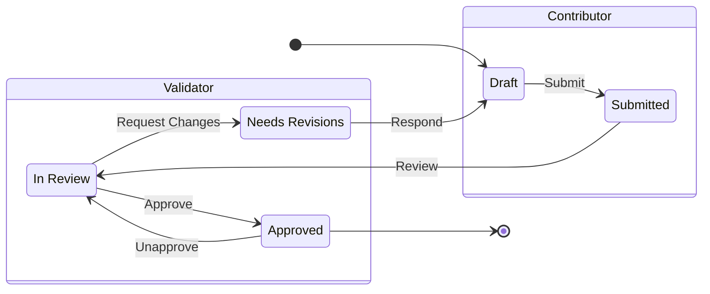

# User Roles and Boundary Workflow

## User Roles

This app supports three kinds of users: **Contributors** that can add new boundaries, **Validators** that can approve or reject them, and **Administrators** that can add new users and utilities, modify existing ones, and export boundaries. In addition, Administrators can act as both Contributors and Validators in the app.

## Boundary Workflow

The boundary workflow is demonstrated in the following stage diagram:

A boundary can be in one of five stages:

- **Draft**: A newly created boundary that the Contributor is still working on. Not ready for review. Can be _edited_ by Contributor, can be _viewed_ by Validator.
- **Submitted**: A boundary ready for review, as submitted by a Contributor. Can be _viewed_ by Contributor. A Validator can begin reviewing it, which will move it to:
- **In Review**: Under active review by a Validator. Can be _viewed_ by Contributor, can be _annotated_ by Validator.
- **Needs Revisions**: The bounday has been reviewed by a Validator who is requesting revisisions. Can be _viewed_ by Validator. A Contributor can respond to it by creating a new **Draft**.
- **Approved**: The boundary has been reviewed by a Validator and found satisfactory.

## Permissions

A user can interact with a boundary in one of three ways:

- **View**: A user can view a boundary, look at its shape, turn data layers on and off, turn reference images on and off, adjust their opacity, turn the shape on and off, and select a basemap. This is a read-only interaction, where none of these adjustments get saved to the boundary.
- **Annotate**: Just like **View**, with the additional ability to add notes to particular areas on the map. Used by Validators for reviewing.
- **Edit**: Just like **View**, with the additional ability to change the shape, delete the shape, upload a new shape, add reference images, set their opacity, and have everything be saved to the boundary. Used by Contributors before they submit a boundary.

Here is a table of permissions for different users at different stages of the boundary:

|                   | Draft | Submitted    | In Review | Needs Revisions | Approved |
|-------------------|-------|--------------|-----------|-----------------|----------|
| **Contributor**   | Edit  | View         | View      | Create Draft    | View     |
| **Validator**     | View  | Start Review | Annotate  | View            | View     |
| **Administrator** | Edit  | Start Review | Annotate  | Create Draft    | View     |

As can be seen, Administrators can work like both Contributors and Validators.

## Visibility

When a new Contributor is added to the system, they must be associated with one or more **Utilities**. A Contributor can submit a boundary for any Utility they are associated with. A Contributor can view all boundaries in any stage related to their Utilities.

When a new Validator is added to the system, they must be associated with a **US State**. A Validator can view all boundaries at all stages for all Utilities related to their US State.

An Administrator can view all boundaries at all stages in the system.

## Notifications

### Submission

When a Contributor submits a new boundary, all Validators that are associated with the boundary's Utility's US State will be notified. In addition, all Contributors associated with that Utility will also be notified.

### Review

When a Validator requests changes for boundary, all Contributors that are associated with the boundary's Utility will be notified.

### Approval

When a Validator approves a boundary, all Contributors that are associated with the boundary's Utility will be notified.

## Navigation

### Welcome Guide

When a Contributor logs in, if they have access to multiple Utilities they will be prompted to pick one, otherwise their sole Utility will be picked for them. If that Utility does not have an existing boundary, they are taken to the Welcome Guide which will guide the user to create a new draft submission for this Utility.

### Submission List

If the Utility does have an existing boundary, then the Contributor is taken to the Submission List, where they can view all their submissions per Utility.

Validators and Administrators are always taken to the Submission List after logging in. Administrators see an Export button on this page, not visible to other users.
