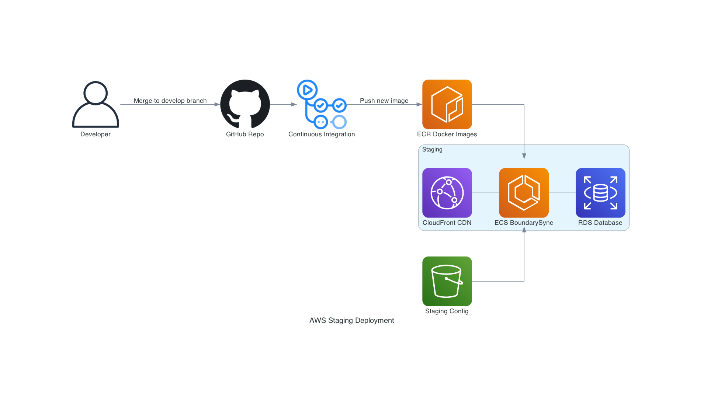

# Diagrams

This repository uses the Python [`diagrams`](https://diagrams.mingrammer.com/) package to generate diagrams.

To run this, ensure you have Python 3.6+ running locally, and all the dependencies installed:

```bash
brew install graphviz
pip install -r requirements.txt
```

then simply run the `main.py` file to generate the diagrams:

```bash
python main.py
```

Currently there are three diagrams:





